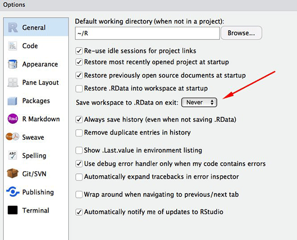

If you have any problems with software installation or downloading data, please 
contact one of the instructors before the course.

## Setup instructions

All the software required to run this course can be installed on your own machine. We also have additional laptops available for use during the course. Alternatively, if installation proves to be difficult, we can also provide you with access to a web-based virtual learning environment.

To install R and RStudio on your own computer, please follow the instructions below:


**R** and **RStudio** are separate downloads and installations. R is the
underlying statistical computing environment, but using R alone is no
fun. RStudio is a graphical integrated development environment (IDE) that makes
using R much easier and more interactive. You need to install R before you
install RStudio. After installing both programs, you will need to install the
**`tidyverse`** package from within RStudio. Follow the instructions below for
your operating system, and then follow the instructions to install the 
**`tidyverse`** package.

### If you already have R and RStudio installed

* Open RStudio, and click on <kbd>Help</kbd> > <kbd>Check for updates</kbd>. If a new version is available, quit RStudio, and download the latest version for RStudio.
* To check which version of R you are using, start RStudio and the first thing
  that appears in the console indicates the version of R you are
  running. Alternatively, you can type `sessionInfo()`, which will also display
  which version of R you are running. Go on
  the [CRAN website](https://cran.r-project.org/bin/windows/base/) and check
  whether a more recent version is available. If so, please download and install
  it. You can [check here](https://cran.r-project.org/bin/windows/base/rw-FAQ.html#How-do-I-UNinstall-R_003f) for
  more information on how to remove old versions from your system if you wish to do so.

### If you don't have R and RStudio installed

#### Windows
* Download R from
  the [CRAN website](http://cran.r-project.org/bin/windows/base/release.htm).
* Run the `.exe` file that was just downloaded
* Go to the [RStudio download page](https://www.rstudio.com/products/rstudio/download/#download)
* Under *Installers* select the file relevant to your operating system
* Double click the file to install it
* Once it's installed, open RStudio to make sure it works and you don't get any
  error messages.

#### macOS
* Download R from
  the [CRAN website](http://cran.r-project.org/bin/macosx/).
* Select the `.pkg` file for the latest R version
* Double click on the downloaded file to install R
* Go to the [RStudio download page](https://www.rstudio.com/products/rstudio/download/#download)
* Under *Installers* select the file relevant to your operating system
* Double click the file to install RStudio
* Once it's installed, open RStudio to make sure it works and you don't get any
  error messages.

#### Linux
* Follow the instructions for your distribution
  from [CRAN](https://cloud.r-project.org/bin/linux), they provide information
  to get the most recent version of R for common distributions. For most
  distributions, you could use your package manager (e.g., for Debian/Ubuntu run
  `sudo apt-get install r-base`, and for Fedora `sudo yum install R`), but we
  don't recommend this approach as the versions provided by this are
  usually out of date. In any case, make sure you have at least R 4.x.
* Go to the
  [RStudio download page](https://www.rstudio.com/products/rstudio/download/#download)
* Under *Installers* select the version that matches your distribution, and
  install it with your preferred method (e.g., with Debian/Ubuntu `sudo dpkg -i
  rstudio-x.yy.zzz-amd64.deb` at the terminal).
* Once it's installed, open RStudio to make sure it works and you don't get any
  error messages.


### Installing `tidyverse`

After installing R and RStudio, you need to install the `tidyverse` package.

* After starting RStudio, at the console type:
  `install.packages("tidyverse")`

* You can also do this by going to <kbd>Tools</kbd> -> <kbd>Install Packages</kbd> and typing the names of the packages separated by a comma. Press <kbd>Install</kbd> (a lot of text will start printing on the panel called "Console")

<br/>

### Testing your installation

On the RStudio panel named "Console" type `library(tidyverse)` and press <kbd>Enter</kbd>

A message similar to this should print:

```
── Attaching packages ─────────────────────────────────────────────────────────────────── tidyverse 1.2.1 ──
✔ ggplot2 3.2.1     ✔ purrr   0.3.2
✔ tibble  2.1.3     ✔ dplyr   0.8.3
✔ tidyr   1.0.0     ✔ stringr 1.4.0
✔ readr   1.3.1     ✔ forcats 0.4.0
── Conflicts ────────────────────────────────────────────────────────────────────── tidyverse_conflicts() ──
✖ dplyr::filter() masks stats::filter()
✖ dplyr::lag()    masks stats::lag()
```
<p></p>

If instead you get the message: 

```
Error in library(tidyverse) : there is no package called ‘tidyverse’
```
 
then your package installation did not work. Please ask the instructors for 
assistance before the course. 

<br />

### Updating `tidyverse`

If you already have R installed and have used `tidyverse` before, then it would be good to check that you are using the latest version. To do this, go to <kbd>Tools</kbd> > <kbd>Check for package updates...</kbd> and look at the list of updates it gives you. If `tidyverse` is in the list, tick the box and press <kbd>Install updates</kbd>. Alternatively, just select all of the available updates and install them.

<br />

### Setting up RStudio

After installing RStudio, change some of its default options (you only need to 
do this once): 

- From the upper menu go to <kbd>Tools</kbd> > <kbd>Global Options...</kbd> 
- _Untick_ the option "Restore .RData to workspace on startup."
- Change "Save workspace to .RData on exit" option to "Never"
- Press <kbd>OK</kbd>



